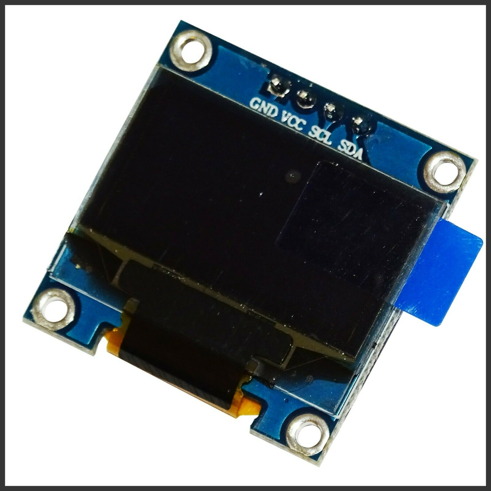
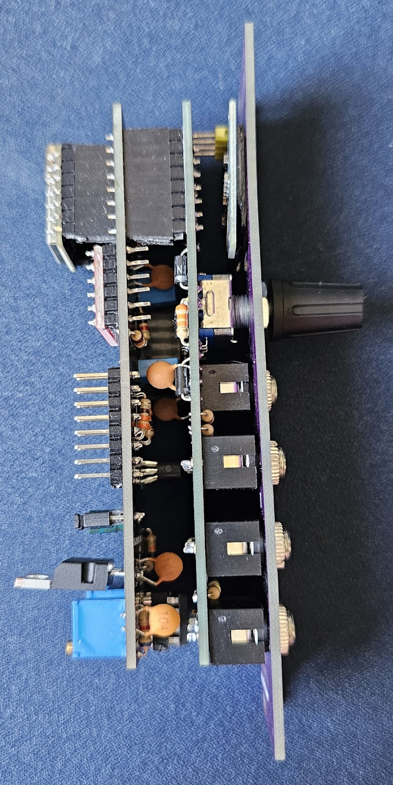
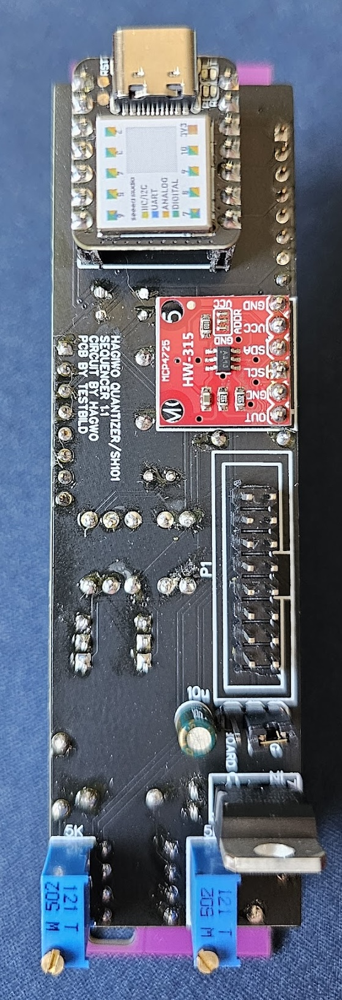

# Voltage Foundry Modular


⚠️ I'm currently finishing a redesign of the hardware and will be ready soon, if you plan to build it, message me thru an issue. 
⚠️

This repository hosts the **Forge** series of modules for the Eurorack format. The **Forge** series is a collection of firmwares developed for the Forge V1 platform based on the Seeeduino Xiao and MCP4725 DAC and Forge V2 hardware based on the Seeeduino Xiao RP2040 anf the MCP4728 DAC.

The modules are designed to be easy to build and modify and be built with through-hole components. The firmware is based on the Arduino platform.

The concept is to have a generic hardware with a display, rotary encoder, trigger inputs and output, CV inputs and outputs allowing different modules by changing the firmware.

This project currently provides the following modules:

- [ClockForge](https://github.com/VoltageFoundryMod/ForgeSeries-CLK/) - A Clock Generator with multiple features like tap tempo, clock division, Euclidean rhythm and more.
- [NoteForge](https://github.com/VoltageFoundryMod/ForgeSeries-DQ/) - A Dual Quantizer with selectable scales and root notes for each channel, octave shift and envelopes.
- [ForgeView](https://github.com/VoltageFoundryMod/ForgeSeries-SCP/) - A scope visualizer with dual-trace, trigger and more.
- [GravityForge](https://github.com/VoltageFoundryMod/ForgeSeries-GEN/) - A generative sequencer with multiple features.

Modules can also be found on ModularGrid:

- [ClockForge](https://modulargrid.net/e/other-unknown-clockforge-by-voltage-foundry-modular)
- [NoteForge](https://modulargrid.net/e/other-unknown-NoteForge-by-voltage-foundry-modular)
- [ForgeView](https://modulargrid.net/e/other-unknown-forgeview-by-voltage-foundry-modular)
- [GravityForge](https://modulargrid.net/e/other-unknown-gravityforge-by-voltage-foundry-modular)

Each new module firmware will be in a separate folder which can be built and uploaded to the Seeeduino Xiao using PlatformIO.

## Production specifications

- Eurorack standard 3U 6HP size
- Power supply: 60mA
- Module depth: 42mm
- On-board converter from 12V to internal 5V

The module can be powered from the MCU USB port while in development mode and from Eurorack 5 pin when in calibration or use. **Do not power from both at the same time as this might damage the module**.

## Project State and Compatibility

- ✅ - Working
- ❎ - Not tested
- 🚧 - Under development
- ❓ - Works with issues

| Firmware             | State | Remarks                                  |
| -------------------- | ----- | ---------------------------------------- |
| ClockForge           | ✅    | V1 HW with 1.x FW, V2 HW with 2.x FW     |
| Dual Quantizer       | ✅    | Only works on V1 hardware                |
| Scope                | ❓    | V1 HW, Spectrum Analyzer not working yet |
| Dual Sequencer       | 🚧    |                                          |
| Sequencer            | ❎    | V1 HW, Original firmware, not tested     |
| Generative Sequencer | ❎    | V1 HW, Original firmware, not tested     |

## Hardware and PCB

### Hardware V2

### Hardware V1

For the PCBs, the module has one main circuit PCB, one control circuit PCB and one panel PCB. The files are available in the [gerbers](./Hardware/gerbers/) directory. There are files for the main board V1 and V2. The control board and panel are the same for both versions.

Check which Firmware is compatible with which hardware version in the table above before ordering the PCBs, as the main board V2 is only compatible with ClockForge 2.x firmware and not with the other firmwares as of now.

You can order them on any common PCB manufacturing service, I used [JLCPCB](https://jlcpcb.com/).

If the panel size is not correctly detected by JLC manually put 30x128.5 mm.

When ordering the display module, make sure to choose an 0.96 I2C oled module that has the pinout specified as GND-VCC-SCL-SDA as opposed to VCC-GND-SCL-SDA (both exist and the latter won't work).

Check each PCB version BOM for required components.







Output Diagram:

```text
|--------------------|
|                    |
|         O          |    1
|                    |
|   O           O    |  2   3
|                    |
|                    |
|   O           O    |  4   5
|                    |
|   O           O    |  6   7
|                    |
----------------------
```

- 1 - Trigger / Clock Input
- 2 - CV In 1
- 3 - CV In 2
- 4 - Digital Out 1
- 5 - Digital Out 2
- 6 - Analog Out 1 (Internal DAC)
- 7 - Analog Out 2 (External DAC)

or for the V2 main board:

- 1 - Trigger / Clock Input
- 2 - CV In 1
- 3 - CV In 2
- 4 - Analog Out 1
- 5 - Analog Out 2
- 6 - Analog Out 3
- 7 - Analog Out 4

## Expander header

The V2 main board has a 8 pin header for expanders. The pinout is as follows:

```text
|--------------------|
|                    |
|   1           2    |  VCC(3.3V)   SCL2
|                    |
|   3           4    |  VCC(OPAMP)  SDA2
|                    |
|   5           6    |  -10V(Ref)   GND
|                    |
|   7           8    |  GND         IN4
|                    |
----------------------
```

## Assembly

When assembling, you can either use a header for the screen or solder it directly, as it is a litte too tall.

## Calibration

The V2 board and 2.0 firmware have an internal calibration mode that allows you to set the input compensation and output gain without needing to do the calculations, so it should be easier to calibrate via it's menus. The output calibration still needs to be done by adjusting the trimmers, but the input compensation can be set in the menu and saved to EEPROM.

## Acknowledgements

The initial [hardware](./Hardware/) is based on Hagiwo 033 module. The quantizer base code is from the [original](https://note.com/solder_state/n/nb8b9a2f212a2) Hagiwo 033 Dual Quantizer and the updated thru-hole project by [Testbild-synth](https://github.com/Testbild-synth/HAGIWO-029-033-Eurorack-quantizer). Some ideas for the clock module were "taken" from the [LittleBen module](https://github.com/Quinienl/LittleBen-Firmware) from Quinie.nl and Pamela's Pro Workout.
